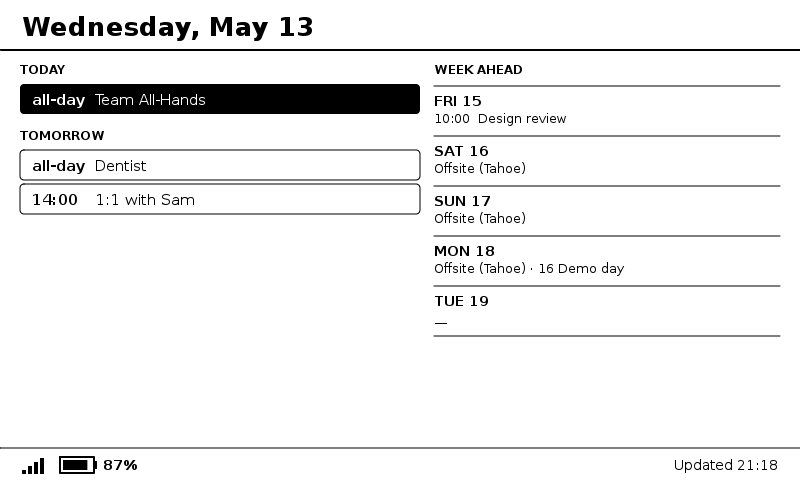

# E-paper calendar display

A Google Calendar display on a Waveshare 7.5" e-paper, driven by a FireBeetle 2
ESP32-E that fetches a pre-rendered bitmap from a small Go server on a Raspberry Pi.



## How it works

```
                              HTTP fetch every 30 min
       ┌──────────────┐       (bat%, RSSI in query)         ┌────────────┐
       │ Raspberry Pi │ ◄────────────────────────────────── │ FireBeetle │
       │  Go server   │ ──────► 48000-byte 1-bit bitmap ──► │  ESP32-E   │
       │              │                                     │            │
       │ Google Cal   │                                     │ Waveshare  │
       │  iCal feed   │                                     │ 7.5" EPD   │
       └──────────────┘                                     └────────────┘
```

## Hardware

- DFRobot FireBeetle 2 ESP32-E
- Waveshare 7.5" V2 e-paper HAT (800×480 B/W, GDEY075T7)
- Raspberry Pi (any model; Pi 2 v1.1 or later works)
- LiPo battery (2000–5000 mAh)
- USB cable for flashing the ESP32
- Jumper wires

## 1. Get your calendar's secret iCal URL

The server reads your calendar via a private iCal URL. No Google Cloud project,
API keys, or OAuth setup is required.

1. Open [Google Calendar](https://calendar.google.com) in a browser.
2. Click the gear icon → **Settings**.
3. In the left sidebar, under **Settings for my calendars**, click the calendar
   you want to display.
4. Scroll down to **Integrate calendar**.
5. Copy the **"Secret address in iCal format"** link.
   It looks like:
   ```
   https://calendar.google.com/calendar/ical/<id>/private-<token>/basic.ics
   ```

> **Keep this URL secret.** Anyone with the link can read your calendar events.
> If it is ever exposed, rotate it by clicking **Reset** on the same Integrate
> calendar page and updating the `-ical-url` flag in your service unit.

## 2. Wire the display

Waveshare 7.5" V2 e-paper HAT → FireBeetle 2 ESP32-E:

| e-paper | FireBeetle GPIO  |
|---------|------------------|
| VCC     | 3V3              |
| GND     | GND              |
| DIN     | 23 (MOSI)        |
| CLK     | 18 (SCK)         |
| CS      | 13 (D7)          |
| DC      | 22 (SCL)         |
| RST     | 21 (SDA)         |
| BUSY    | 14 (D6)          |
| PWR     | 3V3              |

The PWR pin only exists on the **rev 2.3** Driver HAT. Older rev 2.2 HATs don't
have it — skip that row. For extra battery savings you can connect PWR to a spare
GPIO instead of 3V3 and pull it LOW before `esp_deep_sleep_start()` to fully cut
display power between refreshes.

## 3. Build the server

**Option A — Download (recommended).** Grab the prebuilt ARMv7 binary from
[GitHub Releases](https://github.com/Piszmog/esp32-calendar/releases/latest):

```bash
curl -L -o calendar-display.tar.gz \
  https://github.com/Piszmog/esp32-calendar/releases/latest/download/calendar-display_Linux_armv7.tar.gz
tar -xzf calendar-display.tar.gz
```

The tarball contains `calendar-server`, `README.md`,
`firmware/firebeetle_calendar/firebeetle_calendar.ino`,
`firmware/firebeetle_calendar/secrets.h.example`, and
`deploy/calendar.service`.

**Option B — Build locally.** Install
[goreleaser](https://goreleaser.com/install/), then from the repo root:

```bash
goreleaser release --snapshot --clean
```

The ARMv7 binary lands at
`goreleaser-dist/calendar-server_linux_arm_7/calendar-server`. Use this
when iterating on the server code; for normal deploys, Option A is simpler.

**Option C — Build on the Pi.**

```bash
sudo apt install golang-go
cd server && go build -o calendar-server ./cmd/server
```

## 4. Deploy the server

### Copy files to the Pi

```bash
ssh server@esp32-calendar.local "mkdir -p ~/calendar"

scp goreleaser-dist/calendar-server_linux_arm_7/calendar-server \
    server@esp32-calendar.local:~/calendar/calendar-server

scp deploy/calendar.service server@esp32-calendar.local:~/calendar/calendar.service
```

### Install the systemd unit

Edit `~/calendar/calendar.service` on the Pi — set `-ical-url` to the secret
iCal URL you copied in section 1, and update `-tz` to your timezone:

```ini
ExecStart=/home/server/calendar/calendar-server \
  -listen :8080 \
  -ical-url https://calendar.google.com/calendar/ical/<id>/private-<token>/basic.ics \
  -tz America/Denver \
  -fetch-interval 10m
```

> **Security note:** the iCal URL is a secret. Consider storing it in a
> separate file readable only by the service user:
> ```ini
> EnvironmentFile=/home/server/calendar/calendar.env
> # ExecStart uses ${ICAL_URL}
> ```
> and place `ICAL_URL=https://...` in `calendar.env` with `chmod 600`.

Then install and start the service:

```bash
sudo cp ~/calendar/calendar.service /etc/systemd/system/calendar.service
sudo systemctl daemon-reload
sudo systemctl enable --now calendar.service
```

### Verify

```bash
journalctl -u calendar -f
```

You should see `calendar-server <version> starting` followed by a successful
calendar fetch. Then from your laptop:

```bash
curl http://esp32-calendar.local:8080/healthz
```

Open `http://esp32-calendar.local:8080/calendar.png` in a browser to confirm the
rendered image looks correct.

**Give the Pi a static DHCP reservation** in your router so the ESP32's hardcoded
server IP doesn't drift.

Endpoints:

| URL | Purpose |
|-----|---------|
| `http://<pi>:8080/calendar.png` | Preview in any browser |
| `http://<pi>:8080/calendar.bin` | Packed 1-bit bitmap the ESP32 fetches |
| `http://<pi>:8080/healthz`      | Plain-text health + last-fetch age |

## 5. Flash the firmware

**Arduino IDE setup (first time only):**

1. **Boards Manager** → install **esp32 by Espressif**.
2. **Library Manager** → install **GxEPD2** and **Adafruit GFX Library**.

**Every flash:**

1. Copy `firmware/firebeetle_calendar/secrets.h.example` →
   `firmware/firebeetle_calendar/secrets.h` and fill in:
   ```cpp
   const char* WIFI_SSID   = "your-network";
   const char* WIFI_PASS   = "your-password";
   const char* SERVER_HOST = "192.168.1.50";  // Pi's static IP
   ```
2. Open `firmware/firebeetle_calendar/firebeetle_calendar.ino`. Edit
   `SERVER_PORT` in the `USER CONFIG` block if needed.
3. **Tools → Board → DFRobot FireBeetle 2 ESP32-E** (or "ESP32 Dev Module").
4. Select the serial port and click **Upload**.

Watch the serial monitor at 115200 baud. On wake you should see:

```
== calendar wake ==
battery: 4012 mV (76%)
.....
rssi: -55 dBm
GET http://192.168.1.50:8080/calendar.bin?bat=76&rssi=-55
read 48000/48000 bytes
[display refreshes ~15 s later]
```

For scripted re-flashing with `arduino-cli`, see [DEVELOPMENT.md](DEVELOPMENT.md).

**macOS note:** The FireBeetle 2 ESP32-E uses the Silicon Labs CP2102 USB bridge.
On Apple Silicon you may need to approve it once under **System Settings → Privacy
& Security** after first plug-in.

## 6. Customizing

| What | Where |
|------|-------|
| Timezone | `-tz` flag in `deploy/calendar.service` |
| How often the server polls the iCal feed | `-fetch-interval` flag (default `10m`) |
| Which calendar | `-ical-url` — copy that calendar's **Secret address in iCal format** from Settings → Integrate calendar |
| How often the display refreshes | Fixed: aligns to the next :00/:30 wall-clock mark (≈30 min). To change the cadence, edit `nextWakeSeconds()` in the `.ino`. |
| Past-event cutoff | `now.Add(-30 * time.Minute)` in `server/internal/calendar/render.go` |

To preview layout changes without flashing: run the server locally with
`./calendar-server -ical-url <your-url> -listen :8080` and open
`http://localhost:8080/calendar.png` in a browser.

## 7. Updating

### Deploy a new server version

```bash
# Download the latest release tarball
curl -L -o /tmp/calendar.tar.gz \
  https://github.com/Piszmog/esp32-calendar/releases/latest/download/calendar-display_Linux_armv7.tar.gz
tar -xzf /tmp/calendar.tar.gz -C /tmp/

# Stage to a temp name (never overwrite a running binary mid-transfer)
scp /tmp/calendar-server \
    server@esp32-calendar.local:~/calendar/calendar-server.new

# Atomic swap + restart
ssh server@esp32-calendar.local '
  cd ~/calendar &&
  mv calendar-server calendar-server.prev &&
  mv calendar-server.new calendar-server &&
  chmod +x calendar-server &&
  sudo systemctl restart calendar
'

# Verify
ssh server@esp32-calendar.local 'journalctl -u calendar -n 20 --no-pager'
curl -fsS http://esp32-calendar.local:8080/healthz
```

`calendar-server.prev` is kept as a one-cycle rollback target. To roll back:
swap `calendar-server` and `calendar-server.prev` and restart the service.

### Update the firmware

Re-flash via the Arduino IDE with the same steps as section 5. `secrets.h` is
gitignored and preserved across `git pull`.

## 8. Battery life

- Deep sleep current: ~10 µA
- Active draw during a refresh: ~120 mA for ~15 s
- 30-minute refresh interval → ~1 mAh/hour averaged

A 2000 mAh LiPo gets ~80 days between charges; a 5000 mAh battery gets 6+ months.

## 9. Enclosure

3D-printed case: [Weather Station E-Ink Frame](https://www.printables.com/model/1139047-weather-station-e-ink-frame).

## Troubleshooting

| Symptom | First thing to check |
|---------|---------------------|
| Service won't start | `journalctl -u calendar -n 50 --no-pager` |
| Server exits immediately | Bad `-tz` value or missing/invalid `-ical-url` — the server fails fast by design |
| `fetch ical: unexpected HTTP status` in logs | The secret iCal URL was reset or is wrong — re-copy it from Google Calendar → Settings → Integrate calendar and update the service unit |
| Port 8080 unreachable from ESP32 | `sudo ufw status` on the Pi — allow port 8080 if a firewall is active |
| Serial shows WiFi failure / no IP | `WIFI_SSID` / `WIFI_PASS` in `firmware/firebeetle_calendar/secrets.h` |
| Serial shows HTTP 404 or connection refused | `SERVER_HOST` wrong, or service not running — `systemctl status calendar` on the Pi |
| ESP32 boots but display stays blank | Re-check wiring (section 2), or a pack/draw convention mismatch (see DEVELOPMENT.md) |
| Image is inverted | In the firmware, swap `drawInvertedBitmap` → `drawBitmap` |
| Battery reads 0% always | Confirm your FireBeetle has the battery sense voltage divider on GPIO34 (some clones omit it); adjust calibration in `batteryPercent()` in the `.ino` |
| Battery icon obviously wrong | Adjust the LiPo curve in `batteryPercent()` in the `.ino` |
| `arduino-cli` can't find the board | macOS CP2102 driver approval (see section 5); re-run `arduino-cli board list` |
